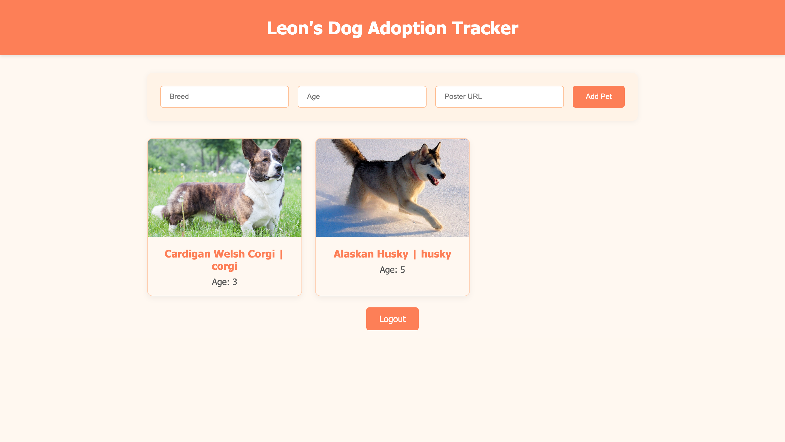

# Movie Watchlist App 🍿

### Description
User can Login/Sign up to make an account for the Dog Adoption Tracker and from there can add the breed, age, and picture for the dog you are looking to adopt. The user will manually add the title, year, genre, and can add a movie poster picture.



### Tech Used:

- HTML
- CSS
- Javascript
- MongoDB
- Node.js

### Lessons Learned:
- How to manage a database using MongoDB
- Applying different parameters for the api
- The use of fetch and catch

```
I completed the challenge: 5
I feel good about my code: 4
Open for any feedback.
```

## Installation

1. Clone repo
2. run `npm install`

## Usage

1. run `node server.js`
2. Navigate to `localhost:3210`

## Credit

Modified from Scotch.io's auth tutorial
